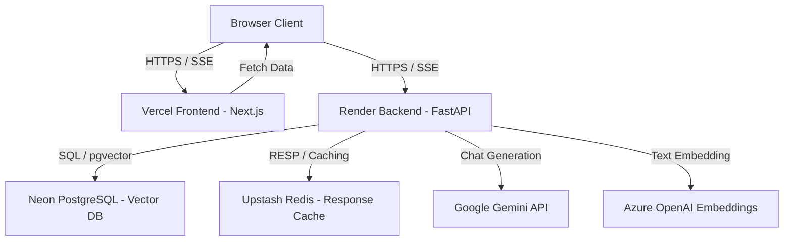

# Public Deployment Guide

This guide describes how to deploy the RAG Developer Portfolio for its v1.0.0 public release on free-tier cloud platforms.

## Deployment Architecture



## Required Services

The production release is designed to run entirely on serverless and free-tier infrastructure.

| Service | Platform | Purpose |
| --- | --- | --- |
| **Frontend** | Vercel | Serves the React/Next.js client via CDN |
| **Backend** | Render | Hosts the FastAPI web service inside a Docker container |
| **Database** | Neon PostgreSQL | Serverless PostgreSQL with `pgvector` extension support |
| **Cache** | Upstash Redis | Serverless, low-latency key-value response and embedding cache |

---

## 1. Database Setup (Neon PostgreSQL)

1. Create a free account at [Neon.tech](https://neon.tech).
2. Create a new project and select **PostgreSQL 16**.
3. Once the database is provisioned, enable the `pgvector` extension. You can run the following SQL query in the Neon Console:
   ```sql
   CREATE EXTENSION IF NOT EXISTS vector;
   ```
4. Copy the connection string from the Neon dashboard. It should look like this:
   `postgresql://<user>:<password>@<neon-host>/neondb?sslmode=require`
5. Keep this connection string for the `DATABASE_URL` env variable.

---

## 2. Cache Setup (Upstash Redis)

1. Create a free account at [Upstash](https://upstash.com).
2. Create a new **Redis Database**. Select a region closest to your Render backend deployment (e.g., `us-east-1` or `eu-central-1`).
3. Under the database details, locate the connection URL under **Rediss Connection String**. It should look like:
   `rediss://default:<password>@<upstash-host>:<port>`
4. Save this URL for the `REDIS_URL` env variable.

---

## 3. Backend Deployment (Render)

We deploy the FastAPI backend on Render using the repository's `render.yaml` blueprint.

1. Create a free account at [Render](https://render.com).
2. In the Render Dashboard, click **New** -> **Blueprint**.
3. Connect your GitHub repository.
4. Render will read the `render.yaml` file from the root of the project.
5. In the blueprint setup page, configure the following environment variables:
   - `GEMINI_API_KEY`: Your Google Gemini API Key.
   - `AZURE_OPENAI_KEY`: Your Azure OpenAI API Key.
   - `AZURE_OPENAI_ENDPOINT`: Your Azure OpenAI Endpoint URL.
   - `DATABASE_URL`: The Neon PostgreSQL connection string (saved from step 1).
   - `REDIS_URL`: The Upstash Redis connection string (saved from step 2).
   - `ALLOWED_ORIGINS`: The Vercel URL (e.g. `https://your-portfolio.vercel.app`).
6. Click **Approve** to deploy the service. Render will build the backend using `backend/Dockerfile` and start the FastAPI server.

---

## 4. Frontend Deployment (Vercel)

1. Create a free account at [Vercel](https://vercel.com).
2. Click **Add New** -> **Project** and import your GitHub repository.
3. In the project configuration, under **Build & Development Settings**, keep the default commands (Next.js is auto-detected).
4. Add the following **Environment Variable**:
   - `NEXT_PUBLIC_API_URL`: The public URL of the Render backend (e.g., `https://rag-portfolio-backend.onrender.com`).
5. Click **Deploy**. Vercel will build the frontend and serve it at a public subdomain.

---

## Environment Variables Reference

### Backend (`backend/.env`)

| Variable | Description | Production Example |
| --- | --- | --- |
| `ENVIRONMENT` | Set to `production` to trigger fail-fast startup validation | `production` |
| `DATABASE_URL` | Neon PostgreSQL connection string with SSL | `postgresql://...` |
| `REDIS_URL` | Upstash Redis connection string over SSL | `rediss://...` |
| `ALLOWED_ORIGINS` | Comma-separated list of allowed frontend domains | `https://your-domain.vercel.app` |
| `GEMINI_API_KEY` | API Key for LLM answers, grading, and query rewriting | `AIzaSy...` |
| `AZURE_OPENAI_KEY` | API Key for generating embeddings | `4f32...` |
| `AZURE_OPENAI_ENDPOINT` | Base URL for Azure OpenAI endpoint | `https://...` |
| `EMBEDDING_PROVIDER` | Set to `azure_openai` | `azure_openai` |
| `GENERATOR_PROVIDER` | Set to `gemini` | `gemini` |

### Frontend (`frontend/.env.local`)

| Variable | Description | Production Example |
| --- | --- | --- |
| `NEXT_PUBLIC_API_URL` | The public endpoint of the FastAPI backend | `https://rag-portfolio-backend.onrender.com` |

---

## Local Production Testing

To test the production configuration locally, use the production-ready Docker Compose file.

1. Ensure you have a `.env` file in the project root containing your API keys (`GEMINI_API_KEY`, `AZURE_OPENAI_KEY`, `AZURE_OPENAI_ENDPOINT`).
2. Run the production build locally:
   ```bash
   docker compose -f docker-compose.prod.yml up --build
   ```
3. The Compose stack will start:
   - **Frontend**: `http://localhost:3000`
   - **Backend**: `http://localhost:8000`
   - **Database**: Local Postgres with pgvector
   - **Redis**: Local Redis 7 container
4. Verify the startup logs in the console to ensure:
   - `Environment: production` is shown.
   - `Database connection: CONNECTED` is shown.
   - `Redis connection: CONNECTED` is shown.
5. Check if the frontend is healthy:
   ```bash
   curl http://localhost:3000/api/health
   ```

---

## Rollback Procedure

If a bad commit causes an outage in production:

### Vercel (Frontend)
1. Go to the **Vercel Dashboard** -> **Deployments**.
2. Locate the last stable deployment.
3. Click the three dots next to it and select **Instant Rollback**.

### Render (Backend)
1. Go to the **Render Dashboard** -> **rag-portfolio-backend**.
2. Select **Events** or **Deployments** on the left menu.
3. Find the last successful build.
4. Click the options menu and select **Rollback to this deployment**.

---

## Known Free-Tier Limitations

> [!WARNING]
> **Render Web Service Cold Starts:** On Render's free tier, the backend web service spins down after 15 minutes of inactivity. When a user first loads the frontend, the backend will take **50–90 seconds** to wake up. To mitigate this:
> - The frontend displays a loading overlay/wake-up status indicator.
> - Or, upgrade to Render's **Starter Plan** ($7/month) to prevent sleeping.

> [!IMPORTANT]
> **Upstash Rate Limiting:** The free tier of Upstash Redis allows up to 10,000 requests per day. Exceeding this limit will trigger rate limits. Since Redis acts as a cache, the backend degrades gracefully on Redis failure, but the retrieval times might increase as it bypasses the cache.

---

## First Deployment Checklist

- [ ] Database created on Neon, and `vector` extension enabled.
- [ ] Redis database created on Upstash.
- [ ] Root/Backend environment variables configured correctly on Render (no localhost).
- [ ] Frontend environment variables configured correctly on Vercel (`NEXT_PUBLIC_API_URL`).
- [ ] Backend `/health` endpoint responds with 200 OK.
- [ ] Frontend is reachable, and the chat console connects to the backend successfully.
- [ ] Initial data ingestion script executed (e.g. running the manual loader or ingestion pipeline on Neon to index documents).
